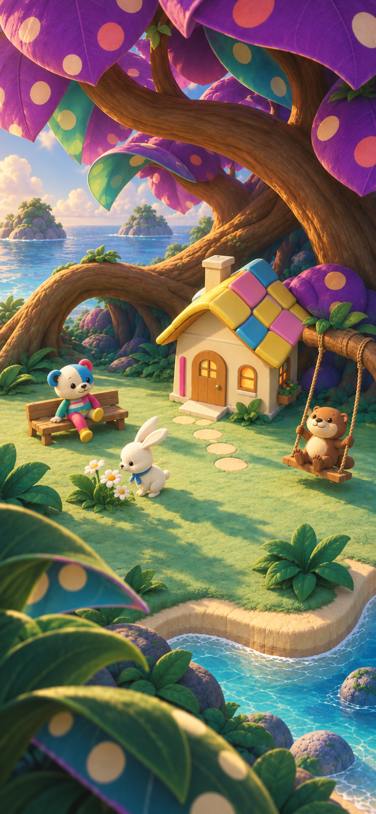

# 巨大植物・水玉・色瓦の参考画像

2026-09-13、ユーザーの「憲章と参考画像として格納して」に基づいて保存。

## 位置づけ

世界表現の参照は[デザイン憲章](../../../product/design-charter.md)に従う。3案目の巨大植物を起点に水玉・色面を加え、陰と余白を整理したC3を保存した。実アプリのスクリーンショット、配信素材、キャラクター設定画ではない。

- 参照する: 家と住民を包む巨木、曲面の大きな水玉、鮮やかな色瓦、木の奥の青緑の陰、広い庭の余白、住民ごとの暮らしが見える構図。
- そのまま移さない: 生成された顔・頭身・布模様・しっぽの差分、固定された配置や地形、細かな質感、画面外への切れ方。
- **ぽこもこは既存デザインを維持する。キャラの変更を行う場合は個別作業にする。** この参考画像から既存キャラを上書きしない。
- UI・学習入力・配置・歩行・保存の契約は変更しない。実装時の画角と表示品質は実アプリで別途検証する。

## 出典

- candidate: `c3-refined`
- 元画像: [c3-refined.png](../../2026-09-13-mysterious-visual-directions/c3-refined.png)の同一バイト複製。
- 手法: built-in image_genによるC2の編集。
- [生成プロンプトと制作記録](../../2026-09-13-mysterious-visual-directions/c3-refinement.md)
- [初期4方向比較](../../2026-09-13-mysterious-visual-directions/comparison.html)
- [ベンチマーク検討](../../2026-09-13-wonder-charter-benchmark.md)

視覚の参考として格納。無文字理解・安全の利用者観察は未実施、runtimeは未実装・未検証。参考画像の格納はrelease認定を意味しない。
