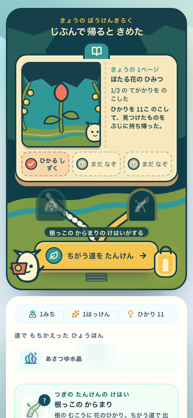
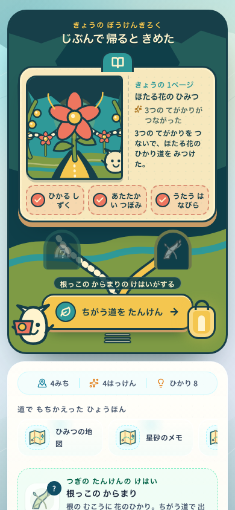
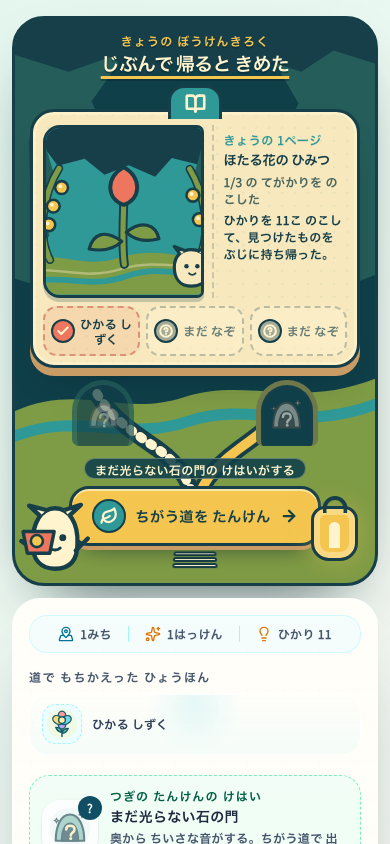
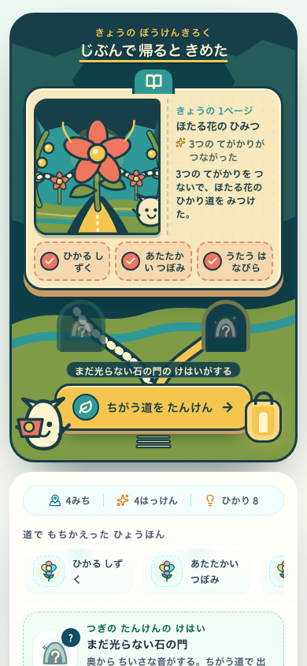
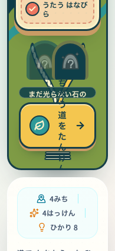

# Research Library concept — 2026-07-19

This image is a direction-setting artifact for the loop after Golden Discovery Page. It belongs in `docs/design`, is not a production runtime asset, and must not enter the PWA precache.

## Current decision

- There is no selected finished visual direction in this folder yet.
- `concept-keyframe-v2-pop.png` is retired as a production target. It overweights cave, paper, tabs, doors, and symbols, and reads as an AI concept board rather than a playable moment.
- `concept-state-grammar-v3.png` is also rejected as a visual-style target. Keep only its abstract constraint that world, observation, and archive must preserve one causal event and one camera identity.
- The visual SSOT is [14_ui_world_motion_spec.md](../../product/14_ui_world_motion_spec.md). `benchmark-yoshi-fukashigi.md` is measured comparison evidence and rationale, not a higher authority.
- The current art direction is **Ibitsu Ecology Pop / いびつ生態ポップ**. It supersedes both the old `70% mysterious field-guide / 30% pop` ratio and **Bright Anomaly Stage / 明るい異変劇場**.
- The next visual checkpoint is exactly three alternatives for the same `root-tangle` moment at 390×844. Each alternative shows one actor, one subject, one math verb, the subject's return, and the actor's counter-pose—not a three-state presentation board.
- A completed discovery becomes a visible journal page rather than another inventory tile.
- Unfinished pages expose only strong silhouettes, so mystery survives without fake content.
- The next expedition is a physical fork in the world, not a dashboard menu.
- Growth is communicated with page edges, stamps, threads, and connected paths.
- Pop comes from character performance, asymmetrical silhouettes, clear action trajectories, and a surprising biological reaction—not from tabs, gloss, neon, or particle density.
- Production UI should keep text and controls in reusable DOM/CSS, use approved model-sheet assets for characters and subjects, and reserve authored SVG for annotations, stamps, and small interface marks. Do not ship the generated image directly.

## RETIRED_DO_NOT_USE — prompt history

The prompts below document how the rejected v2/v3 artifacts were produced. They are not active production prompts.

### RETIRED_DO_NOT_USE — initial prompt

> Using the attached Golden Discovery Page keyframe only as an art-direction reference, create a new original vertical mobile game UX concept for a Japanese children's math exploration game immediately after returning from an expedition. Show a magical field research library that has visibly grown: one completed glowing firefly-flower page, several partial pages with original silhouettes, one obvious physical route lever, a branching trail toward an unseen mystery and a deeper clue, the original cream seed-pod companion with asymmetric leaf sprouts holding a stamped map, and three large clue stamps. Use the same restrained deep-teal, parchment, moss, coral, amber, and turquoise cut-paper/gouache language with consistent dark ink outlines. Prefer spatial connections over dashboards, quiet ordinary mood with one warm focal peak, large child-friendly targets, and no crowded HUD. Original IP only; no spots or existing egg motifs, recognizable characters, items, logos, readable text, photorealism, 3D gloss, neon gradients, pseudo-language, or watermark.

## Source

- `concept-keyframe-v1.png` — retired first pass; historical evidence only
- `concept-keyframe-v2-pop.png` — retired cave/library composition study
- `concept-state-grammar-v3.png` — rejected visual style; retained only as an action → observation → archive logic sketch. The first generated pass was also rejected because green spots made the companion too close to an existing egg motif
- `benchmark-yoshi-fukashigi.md` — benchmark gap, IP boundary, priorities, and screenshot acceptance tests
- Referenced art direction: `../golden-discovery-page-2026-07-19/concept-keyframe-v2.png`

### RETIRED_DO_NOT_USE — pop revision prompt

> Edit the first research-library keyframe into a more pop, joyful version while preserving its mysterious fantasy identity and composition. Target 70% mysterious field-guide fantasy and 30% playful pop. Use larger rounded silhouettes, consistent dark outlines, clearer coral/amber/turquoise/mint color blocking, a bigger flower focal point, oversized collectible page tabs, a chunky spring-mounted route lever, one large icon per route, an excited moving companion, and a few large paper stars or leaf bursts only around interactive states. Keep outer cave layers dark and unfinished pages muted. No readable text, generic dashboard cards, glossy gradients, 3D render, neon, photorealism, particle clutter, recognizable existing IP, logos, or watermark.

## Rejected state grammar study

The v3 study uses the same camera and silhouettes across three states:

1. a bright world with one companion, one mechanism, and one changing subject;
2. an observation drawing that preserves the scene while isolating the causal path;
3. an archive page that turns the event into three sequential pictures and one next-clue silhouette.

The first generated draft added green circular spots to the companion. That draft was rejected rather than normalized because the motif crossed the benchmark's IP boundary. V3 replaces it with a cream seed-pod silhouette and asymmetric leaf sprouts, but the revised benchmark also rejects V3's generic mascot performance, uniform texture, explanatory arrows, triptych completeness, and flowchart-like archive. Production must define the companion through an authored silhouette and six-pose performance sheet before treating any generated image as a character reference.

## Implemented return loop

The following captures were taken through the real onboarding → Game → exploration → return flow at 390×844. They do not use a mocked ReturnSummary fixture.

These captures are implementation evidence for state, layout, DOM order, and accessibility only. They are explicitly not the visual-quality target; deep-teal framing, uniform cut-paper treatment, equal progress pills, and the small generic companion are rejected by the current direction.

| State | Capture | What is real in this run |
| --- | --- | --- |
| Incomplete page |  | One confirmed discovery-page feature and one found clue stamp |
| Completed page |  | Four confirmed discovery-page features, including the big discovery, and all three clue stamps |
| Reduced motion |  | The same completed real run with `prefers-reduced-motion: reduce`; the physical lever transition resolves to `0s` |

Measured on both the incomplete and completed 390×844 states:

- The book precedes the primary action in the DOM and occupies the main visual area.
- The only route-stage button is the amber physical lever. Its rendered height is 60px and its bottom edge is 564px, inside the 620px target.
- The live companion is 76px wide. The two route hints are muted cave openings without button borders or press shadows.
- Meaning-bearing scene copy is at least 12px.
- At a 195×422 CSS viewport, used as the 200% text/layout check, the book ends before the lever starts, the lever remains at least 56px high, and horizontal overflow stays at zero.

The three-second read is: the companion wants to continue; the bud/page has gained one clue or opened into the full flower path; the amber lever is the next place to press. The broader `action → world reaction → observation drawing` transformation remains the next dedicated-encounter slice described in [the benchmark](./benchmark-yoshi-fukashigi.md), not fake progress added to this return screen.

### Isolated layout check

These component-only captures isolate the final header spacing, non-interactive cave arches, and text-zoom behavior from the surrounding app shell. They are layout evidence only; the real-flow captures above remain the state/data evidence.

| Check | Capture |
| --- | --- |
| Incomplete 390×844 |  |
| Completed 390×844 |  |
| Completed at the 200% layout equivalent |  |

In the isolated 390×844 pass the book is 99–375px and the lever is 486–546px at 60px high. The amber heading underline no longer creates a full-width pill or touches the book tab. The route hints have no button border, pressed depth, or focus state. At the 200% layout equivalent, the scrolled book ends before the reachable lever begins and the body width remains equal to the viewport width.
