# 実画面のレイアウト監査

2026-09-09。[図で読む](./index.html#audit) / [全体戦略](./strategy.md) / [画像と版のmanifest](./audit-manifest.json)

## 対象

監査対象は `http://127.0.0.1:5294` の固定ローカル候補 `home-space-v2:101c1ec2-b080-41af-97e5-677ebcff9c73`。2026-09-09に本監査で実際に操作・撮影した。公開中のサイトや、並行作業中の最新ツリー全体を監査したという意味ではない。

- ベースrevision：`d4d157f26b6fac0fea9514377bb1d0f2f0af37da`＋前回のホーム面積・ナビ調整。
- source hash：`399ad78b63e0c6c8eb2a0fd6bf370c51336fb3dfc63348d6149a325d3cfc5d7b`。
- Island配布flag：`mystic-island-v1`。実島候補：`mystic-island-shore-garden-v17`。学習候補：`mystic-island-learning-v2`。
- Codexのアプリ内ブラウザ、390×844／768×1024／1024×768。スクロールバー分の内容幅はviewportより狭い場合がある。OSの表示領域・実機Safariの完全再現ではない。
- 新しい監査専用プロフィール「レイアウト確認」、小学2年生、さんすう、0回答。名前と初回設定を実UIで登録し、音をオフにした。問題の回答や編集の確定保存はしていない。
- キャッシュを消去していない。今回の監査では実SW制御・offline・更新適用を測定していない。画像は本監査内で保存した同一のbytesを目視確認。各hashはmanifestに記録。一部の初期AXログは差分形式である。

## 判定を分ける

| 判定 | 現状 | 理由 |
| --- | --- | --- |
| 見た目・触りたさ | HOLD | 主役より操作帯や空白が優先される場面がある。今回はレイアウト監査であり、成熟景色を含む美術60点採点は未実施 |
| 説明なしの理解・安全 | HOLD | 独立した子どもの参加者0人。退出入口は確認したが、読めない戻るラベルがある |
| 動作・データ | HOLD（限定操作のみ確認） | 開閉・リサイズの往復を確認。記録の空振りを再現。回答保存・PWA・故障を再検証していない |
| 画面間の一貫性 | HOLD | 学習や編集でタブを閉じる原則はあるが、終了操作の位置と各画面の面積配分が不揃い |

Tone alignment：概ねOK。子どもへの罰や羞恥を新たに確認していない。Game feel／Information design／Accessibility：Attention。Failure safety：保存失敗は未評価。Maintainability：個別のCSS縮小を重ねず、6種別の表示ルールで整理する余地がある。これらはリリース可否を保証するものではない。

## 操作とスクリーンショット

01は登録前。明示的な開始から初回設定を行い02へ進み、閉じて03。04〜07で設定と記録を確認し、島から08→09→取消。10でアルバムを確認した。その後11〜14で幅を変え、持ち物から学習を開いて閉じると持ち物へ戻ることも確認した。02は同じ監査内で音設定と画面が安定した後に撮り直した代表画像。

### 01. 初回の入口 — 要整理

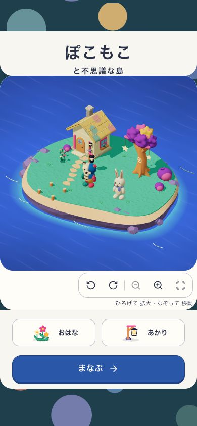

- 良い点：自分で「まなぶ」を押して初回設定へ進める。
- 問題：初回からカメラの道具が並び、何を始める画面かの焦点が散る。
- 提案：島に触れる楽しさと一つの開始操作を中心にする。
- 範囲：初回設定の中間画面は操作したが、全ステップの画像は収録していない。

### 02. 学習を開く — 要改善

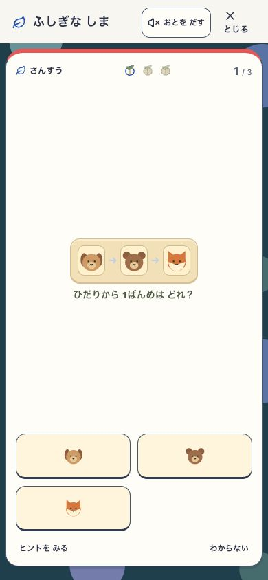

- 良い点：タブが消え、明示的な「とじる」と支援がある。
- 問題：小さい問題の上下が大きく空き、選択肢までの距離が長い。
- 提案：問題タイプごとに必要な高さを使い、問題と答えを近づける。
- 範囲：今回見たのは初回の3択。筆算、英語、採点後の表示は未監査。

### 03. 閉じて島へ — 要改善

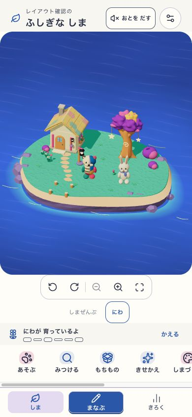

- 良い点：学習を閉じると島へ戻り、問題は自動再開しない。
- 問題：島の枠には海が多い。下に5段の操作帯があり、機能は横スクロールに隠れる。
- 提案：島の実物が見える構図と、必要時に開く道具をセットで設計する。
- 範囲：初期の島のみ。成熟した地区や多数の展示は未確認。

### 04. 設定一覧 — 要整理

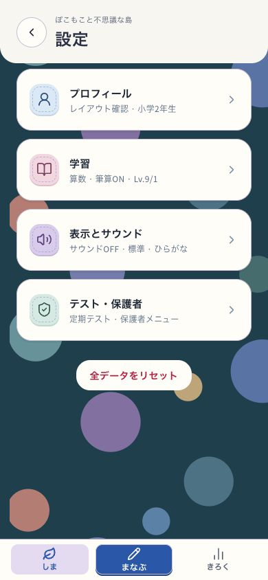

- 良い点：4つのカテゴリと現在の設定値が見える。
- 問題：大型カードと装飾の空白が多く、全データリセットが第一画面で目立つ。
- 提案：まとまった設定行へ整理し、リセットは詳細管理へ置く。
- 範囲：色のコントラスト比、保護者確認の全経路は未測定。

### 05. 学習の設定 — 要整理

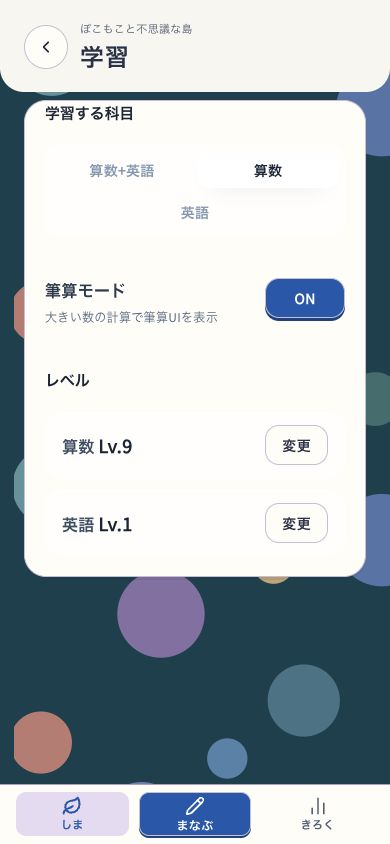

- 良い点：科目、筆算、難しさの変更先が分かれている。
- 問題：大きな枠と余白が、少数の設定項目に対して重い。
- 提案：見出しと現在値を揃え、設定する対象に面積を渡す。
- 範囲：設定値の変更・保存は今回実行していない。

### 06. 記録の入口 — 要整理

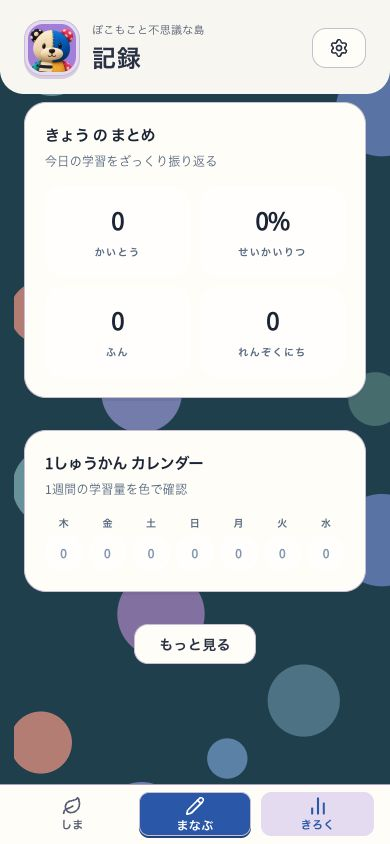

- 良い点：学習量とカレンダーを確認できる。
- 問題：初期状態はゼロの数値が中心で、これから何が残るかが伝わりにくい。
- 提案：学習後に残る内容と次の行動を示す空状態にする。
- 範囲：新規プロフィール、0回答の画面。学習済みデータの密度は未評価。

### 07. もっと見る — 不具合

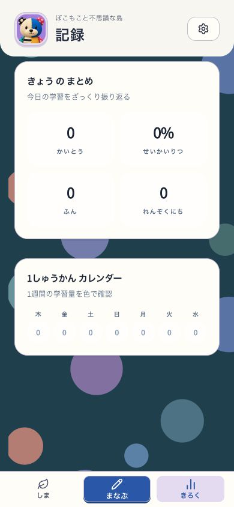

- 良い点：記録から詳細を探す入口が置かれている。
- 問題：押すとボタンだけが消え、内容は増えない。待機・スクロール後も同じ。コード条件も確認。
- 提案：追加内容があるときだけ入口を出すか、有効な詳細を開く。
- 範囲：現在ビルドと作業ツリーのStats.tsxが一致。この調査では未修正。

### 08. 持ち物を選ぶ — 要改善

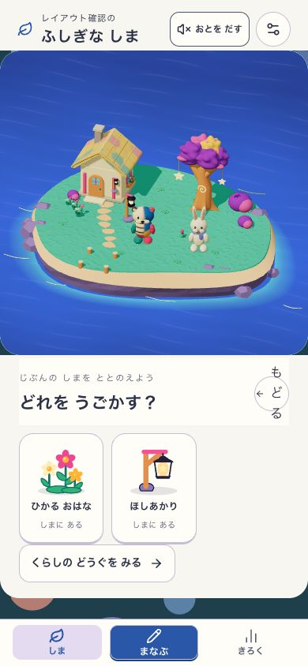

- 良い点：所有物を絵と名前で選べる。
- 問題：一覧より先に大きい島が置かれ、戻るの文字が縦に折れる。
- 提案：一覧を主役にし、戻る操作に縮まない幅を確保する。
- 範囲：所有物2点の初期状態。多数所持時の分類や読上げは未評価。

### 09. 配置を編集 — 要改善

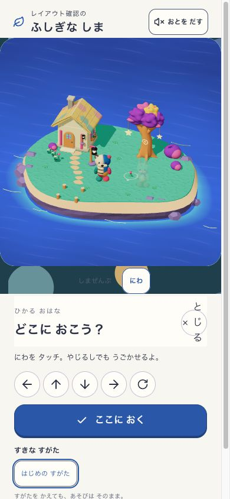

- 良い点：編集中はタブが隠れ、矢印・回転・確定が用意されている。
- 問題：閉じるの文字が縦に折れる。終了操作は島の下にあり、さらに道具が画面外へ続く。
- 提案：上端に取消・確定、実景の下または横に現在の道具を置く。
- 範囲：取消だけを実行。実移動・確定保存・保存失敗は今回未検証。

### 10. 成長を見る — 要整理

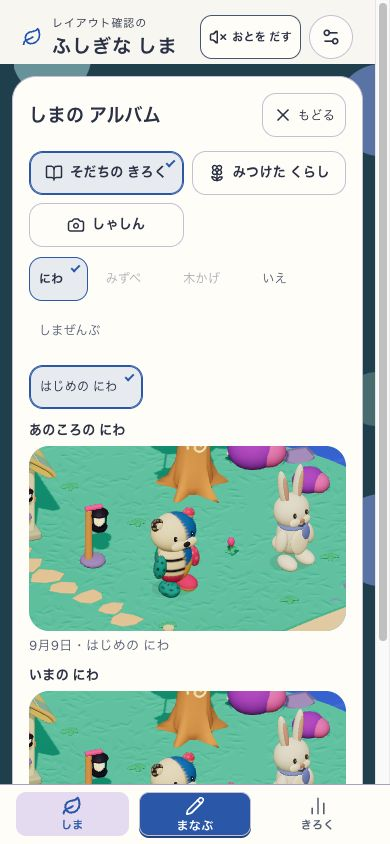

- 良い点：過去と現在を実景で見られる。
- 問題：分類・地区・時点の選択が作品より先に何段も並び、比較が縦に長い。
- 提案：作品を先に見せ、時点とカテゴリはまとめて開く。
- 範囲：初期の同じ段階の比較。写真の撮影・一枚表示は今回未監査。

### 11. 島・縦タブレット — 要改善

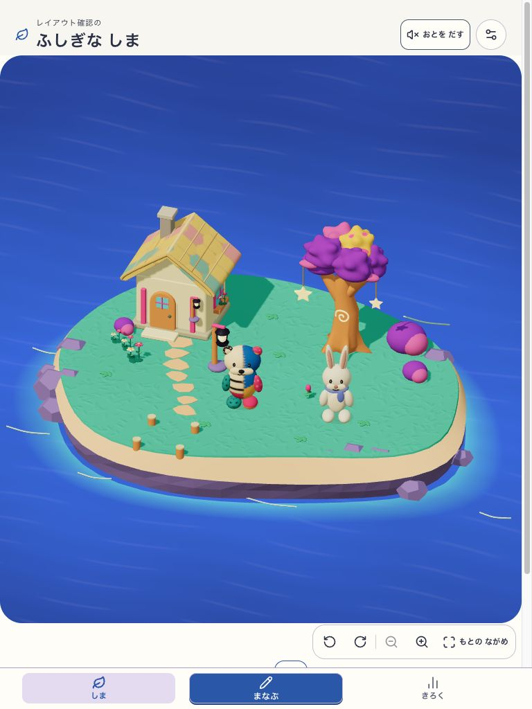

- 良い点：画面幅を使って島を見せられる。
- 問題：縦の世界枠が高く、遊びや持ち物の入口が第一画面に出ない。
- 提案：上下の操作領域を先に確保し、世界は残りの有効範囲へ配置する。
- 範囲：768×1024のブラウザviewport。実iPad Safariではない。

### 12. 持ち物・縦タブレット — 要改善

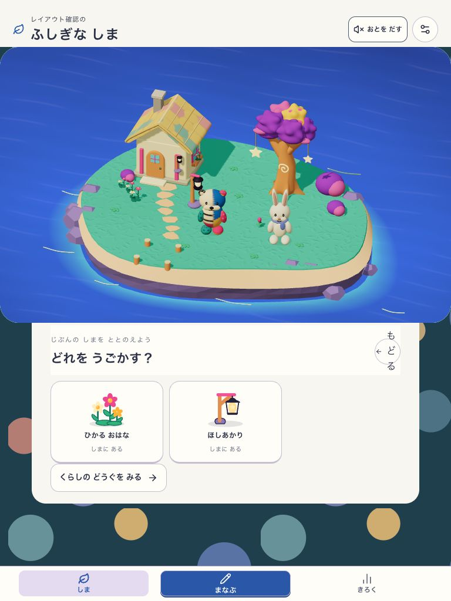

- 良い点：2つの所持品が十分な大きさで見える。
- 問題：広くしても大きな島＋一覧の縦積みが残り、戻るの文字も折れる。
- 提案：一覧＋選択詳細へ再配置し、画面の広さを操作に使う。
- 範囲：項目数が多い場合の一覧は未確認。

### 13. 学習・横タブレット — 要改善

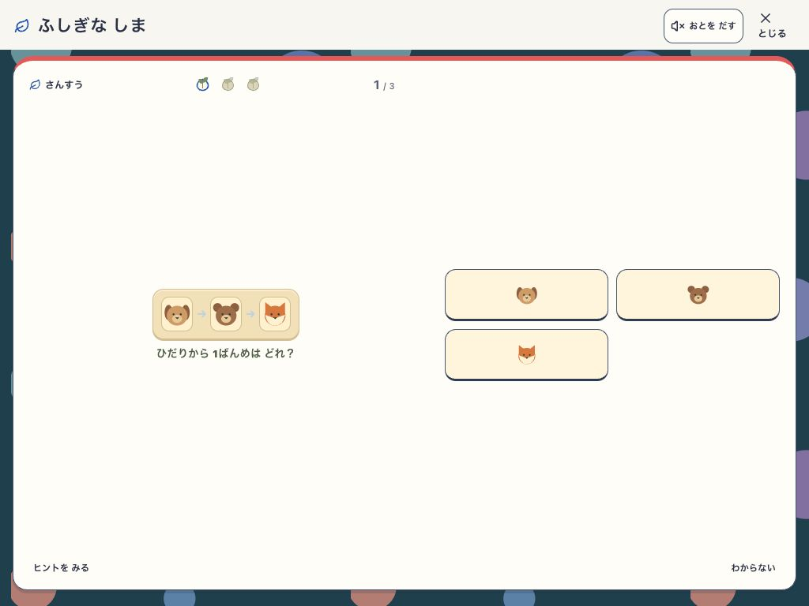

- 良い点：問題・選択肢を左右に分け、タブを閉じている。
- 問題：問題が小さいまま中央の左右へ分かれ、広い空白と長い視線移動が残る。
- 提案：問題の必要サイズを確保し、2列の最大幅と間隔を制限する。
- 範囲：同じ予約の1問目を保持。回答保存やキーの全種類は今回未検証。

### 14. 島・横タブレット — 要改善

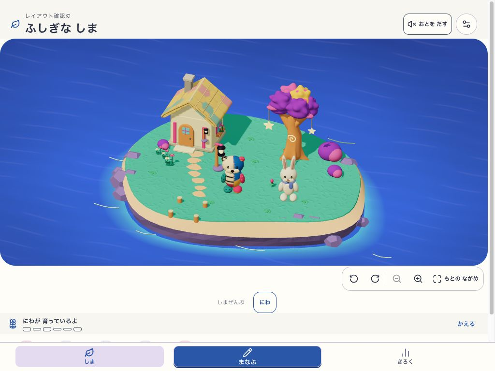

- 良い点：回転後も島へ戻れ、同じ地区の表示を保つ。
- 問題：世界の下に操作を積むため、遊びの入口が下端のナビに隠れる。
- 提案：横に余る領域へ補助操作を置き、島と入口を同時に見せる。
- 範囲：1024×768。リサイズの全保存状態、実機safe areaは未検証。

## 先に直すもの

1. **戻る／閉じるの文字が1文字ずつ折れる**（08、09、12）。タイトルと同じ横並びの中で操作幅が潰れている。退出を探す負担になる。ラベルと操作範囲の幅を確保する。
2. **「もっと見る」が内容を開かない**（06→07）。新規プロフィールでクリック後も詳細が増えない。コード側も追加セクションの既定値falseとshowMoreの条件不一致を確認した。詳細は[コード調査](./navigation-contract.md#7-コード調査で確認した小さな不整合)。
3. **一覧・編集・横画面で主役が小さい／入口が見えない**（03、08、09、11〜14）。島枠を大きくするだけの調整から、各場面の有効領域と操作配置へ移行する。

## アクセシビリティで追加確認するもの

- 見えているリスク：縦に崩れる終了ラベル、小さい問題の図と文字、淡い地区名、横スクロールの奥にある機能。
- 要測定：通常／選択／disabledのコントラスト、実際のタップ領域、文字拡大、キーボードfocusと順序、スクリーンリーダーでの行き先と開始操作の区別。
- 要実機確認：ホームバーとブラウザバー、ソフトキーボード、タッチのドラッグとスクロール、縦横切替、reduced motion、実スピーカーで音を切った状態。

この調査では新規レイアウトの実装、公開、コミットをしていない。研究資料の変更として `npm run docs:check` とHTML資料の実表示を検証する。
